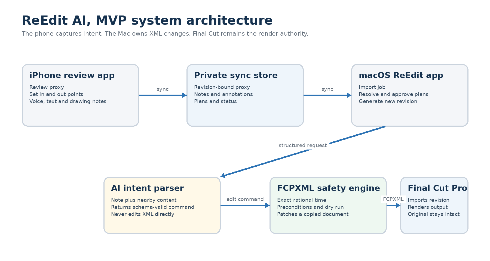
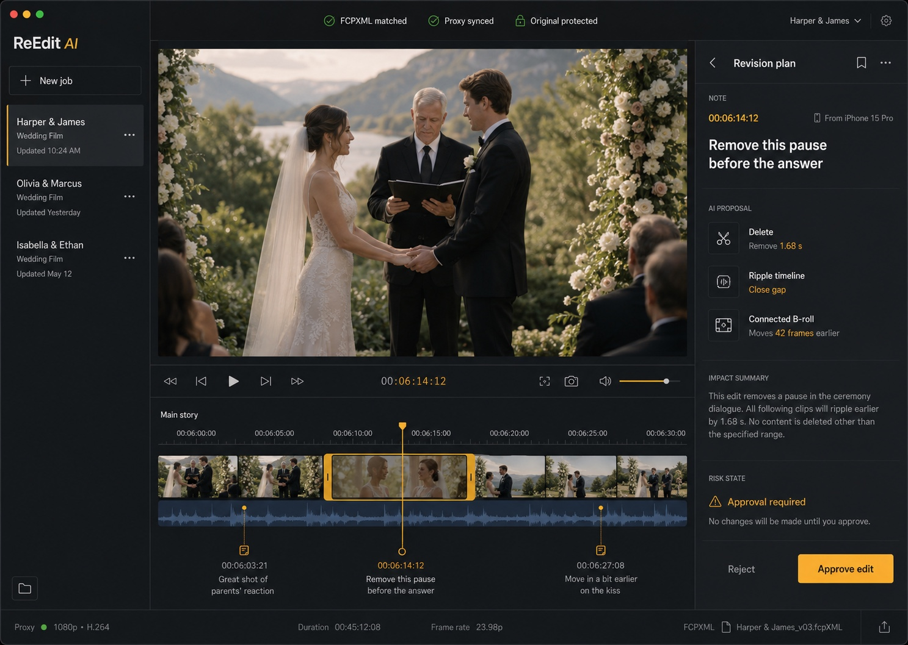

# ReEdit AI — AI Revision System for Final Cut Pro

Product requirements, technical architecture and phased build plan for macOS and iPhone.

- **Prepared for:** Matt, PS Visuals
- **Document:** Build specification v1.1 (converted from the source Word document)
- **Date:** 10 August 2026
- **Primary platform:** Final Cut Pro on macOS, companion review app on iPhone
- **Delivery strategy:** Local first, original safe, deterministic before semantic
- **Build decision:** Start with a narrow revision executor. Prove exact FCPXML round
  trips and six safe commands on real wedding timelines before adding autonomous shot
  selection or broad creative judgement.

This specification is written to be handed directly to Claude Code or Codex. The agent
should treat it as the source of truth, execute one phase at a time and stop at each
exit gate for review.

> **Critical gate:** Do not build the iPhone app or AI layer until an untouched FCPXML
> export can be reimported into Final Cut with acceptable fidelity on at least three
> representative PS Visuals projects.

## 1. Product outcome and strategic boundary

### 1.1 Product statement

ReEdit AI is a revision system for completed Final Cut Pro edits. An editor exports an
FCPXML file and a compressed review video. The editor then reviews the video on an
iPhone, attaches time-bound notes and asks the Mac application to generate a safe
revised FCPXML project. Final Cut Pro remains responsible for media management, final
rendering and the authoritative timeline.

### 1.2 The actual problem

Revision work contains two different classes of task. Deterministic tasks have an
observable target and a measurable operation, such as deleting a selected pause or
muting a clip. Creative tasks require judgement, source search and context, such as
finding a more emotional reaction shot. Combining both classes in the first build would
increase risk and delay the useful product.

**Strategic boundary:** The MVP executes deterministic revisions. It records, explains
and marks creative or unsupported requests. It does not pretend that a language model
can safely make every editorial decision.

### 1.3 Product promise

- Capture revision notes quickly while away from the edit suite.
- Bind every note to the exact timeline revision, frame and selected range.
- Translate supported notes into explicit edit commands.
- Show a dry run and change list before altering any XML.
- Create a new Final Cut project revision without overwriting the source.
- Convert ambiguity into a visible marker instead of making a guess.

### 1.4 Success measures for the personal MVP

- Timecode alignment remains within one project frame for supported frame rates.
- Every generated revision is written to a new file and project name.
- At least 90 percent of the agreed deterministic test notes resolve correctly across
  the curated fixture set.
- Unsupported or ambiguous requests result in markers or approval requests, never
  silent edits.
- XML planning and generation complete in under 30 seconds for a typical 15 minute
  wedding film, excluding media upload and Final Cut rendering.
- The editor can capture a basic note on iPhone in fewer than 10 seconds without
  typing a timecode.

### 1.5 Non-negotiable product principles

- Never edit a Final Cut library bundle directly.
- Never overwrite the imported XML, review proxy or original Final Cut project.
- Never allow the language model to rewrite FCPXML.
- Use exact rational time arithmetic. Do not use floating point seconds for edit
  decisions.
- Bind notes to a specific revision and reject mismatched revisions.
- Require deterministic preconditions before an edit becomes eligible for automatic
  application.
- Preserve unknown XML elements and attributes wherever possible by patching the
  source document instead of regenerating it from scratch.

## 2. Users and end to end workflow

### 2.1 Primary user

The first user is a professional Final Cut Pro editor working with wedding films. The
application should optimise for fast personal use, large local media libraries, 25 fps
projects, connected B-roll, music, dialogue, titles and occasional multicam or compound
material. The architecture may support a commercial product later, but commercial
account systems are outside the MVP.

### 2.2 Golden path

1. In Final Cut Pro, duplicate the project and export the current project as FCPXML.
   Export the full timeline as a compressed H.264 review proxy from the same revision.
2. In the macOS app, create a job and import both files. The app checks project name,
   duration, frame rate, project start time, XML version and file fingerprints.
3. The app creates Revision 001 and copies the source inputs into an immutable job
   folder.
4. The review proxy becomes available on iPhone. The editor scrubs, sets an in point
   and out point, then speaks, types or draws a note.
5. The note syncs to the Mac with its revision identifier, rational timeline range,
   transcript and optional drawing coordinates.
6. The intent parser proposes one supported command or a marker-only fallback. The
   safety engine resolves targets and runs preconditions.
7. The editor reviews a dry run showing the interpretation, affected clips, duration
   change, warnings and confidence state.
8. Approved commands apply to a copied FCPXML document. Commands recorded against the
   same source revision are resolved together and applied in descending source-time
   order.
9. The output is validated and opened in Final Cut as a new named revision. The source
   stays unchanged.
10. Final Cut renders Revision 002. That proxy becomes the source for the next review
    cycle.

### 2.3 Hybrid note capture

Free-form AI alone creates avoidable ambiguity. The iPhone interface should combine
quick actions with natural language. The editor selects a range, taps a command chip
such as Delete, Trim, Mute, Audio or Title, then adds a short voice instruction. AI
fills parameters and resolves context rather than inventing the entire operation.

- **Point note:** one frame position, normally used for markers or title changes.
- **Range note:** explicit in and out points, used for delete, trim, mute and audio
  changes.
- **Clip note:** app identifies the visible timeline clip under the playhead when the
  XML map is available.
- **Drawing note:** normalised vector coordinates on a captured frame. Stored for
  review, not executed in the MVP.
- **Voice note:** original audio plus an en-GB transcript, allowing correction before
  submission.

### 2.4 Revision binding

Every note must include jobID, sourceRevisionID, previewFingerprint,
projectFingerprint and frame rate. A note made against Revision 001 must never be
applied directly to Revision 002. The user can manually migrate it only after the app
remaps the range and displays the proposed target.

## 3. MVP scope and command catalogue

### 3.1 Executable command set

| Command | Behaviour | Required precondition | Initial confidence |
|---|---|---|---|
| `delete_range` | Remove an exact selected interval and ripple later supported content. | Range is valid, targets are supported and no protected construct is crossed. | High |
| `trim_clip_start` | Move a supported clip start later while preserving its end. | One unique clip target and source handles remain valid. | High |
| `trim_clip_end` | Move a supported clip end earlier while preserving its start. | One unique clip target and duration remains positive. | High |
| `mute_audio` | Disable or silence the resolved audio component for the selected range or clip. | Unique supported audio target and explicit scope. | High |
| `set_audio_gain` | Set or offset basic clip gain in dB for a resolved target. | Gain is bounded and no unsupported automation conflict exists. | Medium |
| `replace_title_text` | Replace text in a supported title node without changing timing. | One title target and exact replacement text. | High |
| `add_marker` | Write the original note into the timeline at a point or range. | Valid timeline position. Used as the universal fallback. | High |

### 3.2 Supported input for the first build

- One exported Final Cut project in `.fcpxml` or `.fcpxmld` form.
- One full-length review proxy exported from the same project revision.
- Progressive timelines with a known project frame duration.
- Primary storyline asset clips, gaps, basic audio components, supported titles and
  simple connected clips after the relevant fixture passes.
- Initial test emphasis on 25 fps, followed by 23.976, 24, 29.97 and 30 fps.

### 3.3 Explicit MVP exclusions

- Autonomous selection of unused source footage.
- Creative requests such as "make this more emotional" or "improve the pacing" without
  a selected range.
- Automatic colour correction or grading.
- Magnetic Masks, tracking, spatial effects and third party plugin parameter editing.
- Complex multicam angle changes, compound clip internals and synchronised clip
  internals until each construct has a dedicated parser and fixtures.
- Direct modification of `.fcpbundle` libraries.
- Multi-user accounts, billing, team permissions or an App Store release.
- Unattended automatic import into a production Final Cut library.

### 3.4 Later capabilities, only after MVP acceptance

- Source media indexing using transcripts, faces, shot size, movement, focus and
  visual embeddings.
- Search and suggest a better reaction, wide shot or clean audio phrase.
- Multicam angle replacement and compound timeline support.
- Remote render queue and push notification when a revision is ready.
- Frame.io comment import and export.
- CommandPost shortcut or Final Cut custom share destination for one-action handoff.
- Commercial workspaces, client review links and editor roles.

## 4. System architecture and technology choices

Use a native, local-first architecture. The iPhone captures review intent. The Mac
owns media access, AI requests, XML parsing, validation and Final Cut handoff. The
phone never needs original 4K footage or an AI provider key.



### 4.1 Components

| Component | Form | Responsibility |
|---|---|---|
| ReEditCore | Shared Swift package | Domain models, exact time, revision state, command schemas, validation results and shared utilities. |
| ReEditXML | macOS Swift package | FCPXML bundle loading, DOM preservation, timeline graph, mutation planning, patching and output validation. |
| reedit-cli | macOS command line tool | Phase 0 harness for inspect, validate, roundtrip, plan, apply and diff commands. |
| ReEditMac | SwiftUI macOS app | Job import, note review, dry runs, approval, revision generation, logs and Final Cut handoff. |
| ReEditMobile | SwiftUI iPhone app | Proxy playback, frame snapping, in and out points, voice or text notes, drawings and approval. |
| SyncStore | Protocol and iCloud implementation | Moves immutable proxy assets and revision-bound JSON records between devices. |
| IntentParser | Provider-neutral protocol | Converts note context into one schema-valid command. Initial adapters may target Anthropic or OpenAI. |

### 4.2 Chosen technology

- Swift 6 and SwiftUI for macOS and iPhone interfaces.
- Swift Package Manager for core libraries and the command line harness.
- Foundation XMLDocument on macOS for DOM-based FCPXML patching, with unknown nodes
  preserved.
- AVFoundation and AVPlayer for proxy metadata, frame timing, thumbnails and playback.
- CryptoKit SHA256 fingerprints for source XML, review proxy and generated revisions.
- Keychain for credentials and security-scoped bookmarks for user-selected local
  folders.
- iCloud Drive app container for the personal beta. Sync remains behind a protocol so
  CloudKit or object storage can replace it later.
- Apple Speech or local transcription for voice notes. Store the corrected transcript
  and optionally retain the original audio memo.
- A provider-neutral structured intent interface. AI receives note context, not
  permission to edit files.

### 4.3 Deployment assumptions

- Phase 0 and Phase 1 run entirely on the Mac.
- The iPhone app is distributed to the owner's device through Xcode or TestFlight
  during development.
- The Mac may process queued notes when it next wakes. Real-time remote processing is
  not required for the first release.
- Final Cut import remains a deliberate user action until the generated XML has proved
  reliable.

## 5. Job package, data model and synchronisation

### 5.1 Immutable job layout

Represent every editing job as a folder with immutable inputs and append-only
revisions. A suggested layout is:

```
Smith-Wedding.reedit/
  manifest.json
  source/
    revision-001.fcpxmld
    revision-001.sha256
  review/
    revision-001.mp4
  notes/
    revision-001.notes.json
  plans/
    revision-002.plan.json
  output/
    revision-002.fcpxmld
    revision-002.diff.json
  logs/
    audit.jsonl
```

### 5.2 Core entities

- **Job:** Stable identifier, display name, creation date, local folder bookmark and
  current revision.
- **Revision:** Immutable source XML fingerprint, proxy fingerprint, project metadata,
  parent revision and status.
- **RevisionNote:** Point or range, revision binding, original note, corrected
  transcript, drawing data and capture metadata.
- **EditCommand:** Schema-valid requested operation, parameters, target selector,
  preconditions and interpretation text.
- **EditPlan:** Ordered set of commands resolved against one source revision,
  including conflicts, warnings and dry-run diff.
- **RevisionDiff:** Machine-readable and human-readable record of changed nodes,
  duration shifts and output fingerprint.

### 5.3 Time representation

Store edit time as reduced rational values, matching FCPXML notation. The core type
should hold a signed 64-bit numerator and positive 64-bit denominator. Arithmetic must
use overflow-checked operations, greatest common divisor reduction and explicit
conversion to and from CMTime. Floating point values may be used for display only.

```swift
struct FCPTime: Codable, Hashable, Comparable {
    let numerator: Int64
    let denominator: Int64
}
// Valid examples: 1001/30000s, 1/25s, 3600s
// Forbidden for edit logic: Double seconds
```

### 5.4 Proxy to project mapping

- The review export must cover the complete project from its start without handles or
  omitted sections.
- Read the project start and frame duration from FCPXML. Read proxy duration and
  nominal frame rate from AVFoundation.
- Map proxy time zero to the source project sequence start. Store the mapping in the
  revision manifest.
- Snap note positions and in or out points to the project frame grid before saving.
- Reject import when duration differs beyond one frame or when frame rate metadata
  conflicts.
- Use fingerprints to prevent a proxy from one export being combined with XML from
  another revision.

### 5.5 Synchronisation rules

- The Mac creates the authoritative job and immutable revision records.
- The iPhone downloads only the compressed proxy, manifest subset and notes required
  for review.
- Notes use append-only identifiers. Editing a note produces a new note version rather
  than silently replacing history.
- Conflicts resolve by retaining both note versions and asking the user which to keep.
- Generated FCPXML remains Mac-only. The iPhone receives plan summaries and status,
  not the full production XML unless needed for diagnostics.
- The app must tolerate delayed iCloud synchronisation and resume partial asset
  downloads.

## 6. FCPXML safety engine

### 6.1 First engineering objective

**Phase 0 proof:** The first executable should load, inspect, copy and reserialise
real FCPXML without intentional edits. Reimport the result into a disposable Final Cut
event and compare it with the source. If complex project fidelity is unacceptable,
stop and catalogue the failure before building user interfaces.

### 6.2 Loader requirements

- Accept both `.fcpxml` files and `.fcpxmld` bundles.
- Preserve the source FCPXML version. Never upgrade or downgrade it implicitly.
- Copy the source into the job before parsing and make the copy read-only at the
  application layer.
- Resolve resources, project, sequence, spine and clip references without requiring
  access to original media for deterministic timeline edits.
- Preserve unknown elements, attributes, ordering, effects and metadata by retaining
  the source DOM.
- Build a separate normalised timeline graph for analysis. Patch the original DOM only
  after a plan passes validation.
- Return typed errors with XML path, node identity and recovery guidance.

### 6.3 Normalised timeline graph

```
TimelineGraph
  projectID, projectName, fcpxmlVersion
  projectStart, duration, frameDuration
  nodes: [TimelineNode]

TimelineNode
  stableID, xmlPath, kind, parentID, lane
  absoluteStart, duration, sourceStart
  resourceRef, role, capabilities, children
```

Generate stableID from the source revision fingerprint plus an XML path and node
fingerprint. Store mapping in the sidecar manifest rather than injecting proprietary
metadata into production XML. Absolute times exist only in the graph. The serializer
converts them back into the local offsets expected by the retained XML structure.

### 6.4 Mutation pipeline

1. Parse XML and build the normalised graph.
2. Resolve all note ranges against the source revision before applying any edit.
3. Convert each supported intent into a command with explicit preconditions.
4. Detect overlapping ranges, contradictory commands and protected constructs.
5. Create a dry-run graph and RevisionDiff. Do not touch the source DOM.
6. Ask for approval when required.
7. Apply approved commands in descending source-time order so earlier ripple edits do
   not move later source coordinates.
8. Patch a fresh copy of the source DOM.
9. Run structural, temporal and referential validation.
10. Write atomically to a temporary file, fingerprint it, then publish it as a new
    revision.

### 6.5 Command semantics

#### delete_range

Remove the exact selected interval from supported nodes. Split nodes at range
boundaries when necessary. Shift later supported timeline content by the deleted
duration. The planner must explicitly determine what happens to connected children and
audio components. If a connected item loses its valid anchor and cannot be reattached
without changing meaning, fail the command and add a marker.

#### trim_clip_start and trim_clip_end

Resolve one clip target. Change source start, duration and relevant offsets using
exact time arithmetic. Preserve the opposite clip edge. Reject a trim that produces a
non-positive duration, exceeds available source media, crosses a transition or
invalidates a connected child.

#### mute_audio

Resolve whether the note targets the clip audio, a named audio component or the
selected range. Prefer a reversible FCPXML representation supported by the source
version. Do not mute unrelated components. If target scope is unclear, request
approval or create a marker.

#### set_audio_gain

Support simple clip gain first. Clamp values to a configured safe range and expose the
final value in the dry run. Do not modify complex existing keyframe automation until
dedicated tests cover it. A note saying "lower the music" must identify a role, clip
or selected range before execution.

#### replace_title_text

Resolve a single title node at the note position. Replace only the supported text
field and preserve timing, style, parameters and connected position. Reject multiple
possible title targets.

#### add_marker

Add a standard marker containing the original note and interpretation status. Use a
point marker by default and a range marker only when supported by the source FCPXML
version. This command is the safe fallback for every unsupported or ambiguous request.

### 6.6 Validation layers

- XML is well formed and source version is unchanged.
- All retained resource references resolve.
- Durations are positive where required and project duration matches the calculated
  graph.
- Offsets and source ranges align to the project frame grid unless the source
  legitimately uses subframe audio time.
- No generated identifier collides with an existing identifier.
- The output imports into a disposable Final Cut event during the integration test
  gate.
- The generated project name clearly includes the new revision number.
- The source and output fingerprints differ only when an edit was intentionally
  applied.

### 6.7 Unsupported construct policy

Every parsed node receives capability flags. Examples include canDeleteRange,
canTrimStart, canTrimEnd, canEditAudio and canEditTitle. Unknown nodes default to
read-only. A command may cross only nodes that explicitly advertise the required
capability. This converts missing implementation into a visible limitation instead of
silent damage.

## 7. AI intent and media analysis layer

### 7.1 AI responsibility

AI interprets human language. It does not own timeline arithmetic, target resolution,
validation, file access or XML mutation. The parser receives a constrained context and
returns one structured command proposal or marker-only fallback.

### 7.2 Input context

- Original note and corrected transcript.
- Quick action selected by the editor, if any.
- Point or range in rational project time.
- Names and basic properties of candidate timeline nodes intersecting that range.
- A short nearby dialogue transcript when available.
- One or more sampled frames only when visual context is required and the user has
  permitted provider upload.
- The exact list of supported command types and parameter bounds.

### 7.3 Required output

Use tool calling or schema-constrained structured output. Reject plain prose. The
response contains commandType, range, target hints, parameters, concise
interpretation, ambiguity flags and questions. Model-reported confidence is advisory
only.

### 7.4 Safety score

Do not trust a model confidence number by itself. Compute eligibility from
deterministic evidence: schema validity, revision match, explicit range, unique
target, supported capability, parameter bounds, conflict status and import-risk
category. Suggested states are:

- **Auto eligible:** all deterministic preconditions pass and the command type is on
  the personal allow-list.
- **Approval required:** the plan is valid but changes duration, has more than one
  plausible target or touches a medium-risk construct.
- **Marker only:** any required precondition fails, the request is subjective or the
  construct is unsupported.

### 7.5 Provider abstraction

```swift
protocol IntentParser {
    func proposeCommand(
        for note: RevisionNote,
        context: IntentContext
    ) async throws -> CommandProposal
}
```

Implement one provider first, but keep the protocol independent. Provider keys stay in
the Mac Keychain. The iPhone sends notes to the private sync store and never receives
an API key. Log request identifiers and token usage, but never log secrets or full
client media paths.

### 7.6 Semantic media search, later phase

Replacing a shot with a better reaction requires event-level media access and a
searchable index. When the deterministic system is stable, build a separate MediaIndex
service that works from proxies and transcripts. It should rank candidates and show
them to the editor. It should not silently replace shots.

- Index clip identity, source time, transcript, speakers, detected faces, shot size,
  movement, focus quality, exposure and visual embeddings.
- Export the complete Final Cut event XML or ingest a user-selected proxy folder so
  unused clips exist in the index.
- Return three ranked replacement candidates with evidence and preview thumbnails.
- Require human selection before generating a replace-clip command.

### 7.7 Prompt injection boundary

Treat transcripts, title text and filenames as untrusted content. They can describe
footage but cannot change system instructions, command permissions or file paths. The
intent parser receives a fixed command schema and no raw file-writing tool. The safety
engine validates every output independently.

## 8. macOS and iPhone experience

### 8.1 macOS information architecture

- **Jobs:** List active jobs, current revision, outstanding notes, sync state and last
  generated output. Creating a job begins with XML and proxy selection.
- **Import check:** Show project name, frame rate, duration, FCPXML version, proxy
  match and any unsupported constructs. Block the job when XML and proxy do not match.
- **Notes:** Display notes in timeline order with thumbnail, original note,
  transcript, range, quick action and interpretation status. Allow correction before
  planning.
- **Edit plan:** Group proposed commands into Auto eligible, Approval required and
  Marker only. Each row shows what will change, why, target clips, duration effect and
  warnings. Allow individual or batch approval.
- **Revision history:** Show parent revision, source and output fingerprints, note
  set, command set, change summary, import status and created files. Provide Reveal in
  Finder and Open in Final Cut actions.
- **Diagnostics:** Provide exportable redacted logs, XML validation results and
  fixture identifiers. Do not expose client paths or AI keys in routine logs.

### 8.2 iPhone screens

- Job list with proxy download and revision state.
- Full-screen AVPlayer review with visible timecode, frame stepping and playback speed
  controls.
- In and out buttons that snap to frame boundaries.
- Quick command chips: Delete, Trim start, Trim end, Mute, Audio, Title and Note only.
- Press-and-hold voice capture, transcript correction and text entry.
- Drawing overlay with undo, colour choice and a captured reference frame.
- Notes drawer ordered by timeline position.
- Plan approval view with concise change summary and warnings.
- Offline note capture. Synchronise when connectivity returns.

### 8.3 Review proxy preset

Start with H.264, 720p, project frame rate, approximately 1.5 Mbps video and 96 kbps
stereo AAC. Make these settings configurable after real transfer tests. The proxy must
preserve the complete project duration and must not add an intro card, watermark
duration or handles that alter mapping.

### 8.4 User-facing safety language

- **Ready to apply:** all checks passed.
- **Review required:** valid edit with a risk or target choice.
- **Marker only:** the app understood the note but cannot execute it safely.
- **Revision mismatch:** this note belongs to a different video version.
- **Import blocked:** XML and review video do not represent the same timeline.

### 8.5 Approved macOS visual reference

Use the reference below to guide the hierarchy, density and visual character of the
macOS review workspace. Adapt controls to native SwiftUI behaviour and accessibility,
but preserve the core composition and restraint.



- Preserve the three-column structure: job list, video and revision timeline, then the
  active revision inspector.
- Keep the video dominant. The timeline supports review and annotation rather than
  imitating the complete Final Cut interface.
- Use near-black graphite surfaces, warm white text, restrained separators and minimal
  elevation.
- Reserve amber for the active job, selected timeline range, playhead, warnings and
  the primary approval action.
- Keep the right inspector focused on one note, its proposed command, impact, risk
  state and approval decision.

## 9. Privacy, security and operational safety

### 9.1 Local-first defaults

- Original media stays on the Mac or existing production storage.
- Only compressed review media enters the private sync folder.
- Do not send full review videos to a language model by default.
- Perform voice transcription on device or on the Mac when practical.
- Send note text, constrained timeline context and selected frames only when required.
- Give the user a per-job switch that forbids external AI media upload.

### 9.2 Credentials and permissions

- Store provider credentials in the macOS Keychain.
- Use security-scoped bookmarks for user-selected job and export folders.
- Request the minimum macOS automation permission only when Final Cut handoff is
  enabled.
- Never place secrets, client names or full filesystem paths in analytics.
- Use private iCloud containers for personal beta data.

### 9.3 Data retention

The user can delete downloaded iPhone proxies without deleting the Mac job. Deleting
an entire job requires explicit confirmation and should move local content to the
system Bin where practical. Revision audit logs remain with the job unless the user
requests permanent removal.

### 9.4 Failure behaviour

- A crash during generation leaves the source untouched and removes or quarantines
  the incomplete temporary output.
- A failed command does not partially publish a revision.
- A failed batch identifies each failed command and permits generation from the
  remaining approved commands only after explicit confirmation.
- An unrecognised FCPXML version opens read-only until compatibility tests pass.
- A model timeout leaves the original note available for manual marker creation.

## 10. Testing and acceptance criteria

### 10.1 Test pyramid

- Unit tests for FCPTime parsing, reduction, arithmetic, comparison, overflow and
  CMTime conversion.
- Golden-file tests for FCPXML load, timeline graph construction, no-op roundtrip,
  mutation and diff output.
- Property tests for time transforms, frame snapping and edit ordering.
- Integration tests that import generated FCPXML into a disposable Final Cut event.
- Device tests for iPhone playback, exact range capture, offline notes and sync
  recovery.
- End to end tests using anonymised representative wedding projects and real revision
  notes.

### 10.2 Required fixture set

| ID | Fixture | Purpose | Gate |
|---|---|---|---|
| F01 | 25 fps primary storyline with simple asset clips | No-op roundtrip, delete and trims | Required |
| F02 | Connected B-roll and music beneath dialogue | Anchoring and ripple behaviour | Required |
| F03 | Basic titles and title parameters | Text replacement fidelity | Required |
| F04 | Audio components, roles and existing gain | Mute and gain targeting | Required |
| F05 | Gaps and transitions around edit range | Protected construct handling | Required |
| F06 | 23.976 and 29.97 project samples | Rational time and frame snapping | Before beta |
| F07 | Compound and multicam examples | Read-only detection and marker fallback | Before beta |
| F08 | Unknown effect and metadata nodes | DOM preservation | Required |

### 10.3 Phase 0 acceptance

- CLI identifies project, sequence, frame duration, project start, total duration and
  key node counts.
- No-op output is well formed and preserves the source version and resources.
- No-op output imports into Final Cut for F01 through F05 and one complex real
  project.
- A visual comparison finds no unexplained edit, timing, title, audio or effect loss
  in the agreed supported subset.
- Unsupported constructs are reported with paths and capability flags.

### 10.4 MVP definition of done

- All seven catalogue entries, including marker fallback, have unit and integration
  coverage for their supported subset.
- The app never writes into the original job input or Final Cut library bundle.
- Proxy note time maps to project time within one frame across supported frame rates.
- Overlapping or contradictory commands are detected before XML mutation.
- Every generated revision has an audit record and human-readable diff.
- Generated output imports into Final Cut for the complete required fixture set.
- The iPhone captures point, range, voice, text and drawing notes offline.
- A queued note synchronises and becomes a Mac edit plan after connectivity returns.
- All ambiguous test notes become approval requests or markers, with zero silent
  unsupported edits.

### 10.5 Manual client-work safety test

Before using the application on live client work, run it on three completed projects
copied into test libraries. Export source and revised renders, place them on aligned
timelines and inspect every intended change plus all regions around connected clips,
transitions, titles, audio edits and effects. Do not promote a command type to Auto
eligible until it passes this test repeatedly.

## 11. Development phases and exit gates

Durations are planning estimates for a competent developer using Claude Code or Codex
with active human review. Vibe coding without tests or source control will shorten the
first demo and lengthen the route to a trustworthy product.

| Phase | Outcome | Deliverables | Estimate | Exit gate |
|---|---|---|---|---|
| 0 | Feasibility harness | SwiftPM core, FCPTime, XML loader, inspector, no-op roundtrip, graph report and Final Cut import fixtures. | 1 to 2 weeks | Three representative projects pass the agreed fidelity check. |
| 1 | Mac deterministic core | Job package, six executable commands, marker fallback, dry run, diff, CLI and basic Mac interface. | 3 to 5 weeks | Required command tests pass and source files remain immutable. |
| 2 | iPhone review | Proxy playback, range capture, notes, voice, drawings, offline state and private synchronisation. | 2 to 4 weeks | One-frame mapping and offline sync pass on device. |
| 3 | AI intent parser | Structured provider adapter, hybrid quick actions, approval states, safety scoring and redacted logs. | 1 to 2 weeks | Curated note set reaches target accuracy with zero unsafe silent edits. |
| 4 | Integration hardening | Final Cut handoff, more fixtures, crash recovery, performance, diagnostics and personal beta. | 3 to 6 weeks | Three full projects complete end to end and manual render comparison passes. |
| 5 | Semantic search | Event media indexing, candidate search and human-approved replacement suggestions. | Separate project | Only starts after MVP use proves the demand. |

### 11.1 Build order

1. Collect three anonymised FCPXML fixtures and matching review proxies from real
   work.
2. Build FCPTime and the CLI inspector.
3. Prove no-op roundtrip fidelity in Final Cut.
4. Implement one command, add_marker, end to end.
5. Implement trim commands, then delete range, then audio and title commands.
6. Add job packaging, dry-run plans, immutable outputs and audit diffs.
7. Build the Mac interface around the proven engine.
8. Build iPhone review and sync.
9. Add AI intent parsing after quick actions already work without AI.
10. Run personal beta on copied completed projects before any live work.

### 11.2 Stop conditions

- No-op reimport loses critical effects or structure used in normal PS Visuals
  projects.
- The app cannot reliably match review proxy timing to project timing.
- Connected clip behaviour cannot be made deterministic for the target workflows.
- Final Cut rejects generated XML after structural validation.
- The user needs semantic shot replacement more than deterministic revision
  execution. If so, redefine the product before continuing.

## 12. Repository structure and engineering standards

### 12.1 Suggested repository

```
ReEdit/
  README.md
  docs/
    product-spec.md
    architecture-decisions/
  Packages/
    ReEditCore/
    ReEditXML/
    ReEditSync/
  Apps/
    ReEditMac/
    ReEditMobile/
  Tools/
    reedit-cli/
  Tests/
    Fixtures/
    GoldenFiles/
    Integration/
  Scripts/
    verify-fixtures.sh
```

### 12.2 Engineering rules

- Use git from the first commit. Each phase lands in small, reviewable commits.
- Write a failing test before changing timeline arithmetic or XML mutation behaviour.
- No force unwraps in parser, synchronisation or file-writing code.
- Use typed domain errors with user-facing recovery text.
- Use dependency injection for filesystem, clock, UUID generation, sync and AI
  provider.
- Keep XML parsing and mutation outside SwiftUI views.
- Keep provider SDK types outside domain models.
- Perform writes atomically and preserve a source fingerprint before every plan.
- Do not add third party dependencies unless the standard library or Apple frameworks
  are clearly insufficient. Record the decision in an ADR.
- Run swift format, static analysis, unit tests and fixture tests before marking a
  task complete.

### 12.3 Command line contract for Phase 0

```
reedit inspect <input.fcpxml|input.fcpxmld>
reedit validate <input>
reedit roundtrip <input> --output <path>
reedit graph <input> --json <path>
reedit plan <input> --notes <notes.json> --output <plan.json>
reedit apply <input> --plan <plan.json> --output <revision.fcpxmld>
reedit diff <source> <revision> --json <diff.json>
```

(`plan`, `apply` and `diff` are implemented in Phase 1; the contract is fixed here.)

### 12.4 Observability

- Write an append-only JSONL audit log per job.
- Record revision fingerprints, command IDs, precondition results, output fingerprint
  and elapsed time.
- Redact client names, free-form transcript content, credentials and absolute paths
  from diagnostic exports unless the user explicitly includes them.
- Use os.Logger for runtime logs with privacy annotations.

## 13. Risks and mitigations

| Risk | Consequence | Level | Mitigation |
|---|---|---|---|
| FCPXML roundtrip loses unsupported data | Reimport may drop or alter features that XML does not represent. | High | Phase 0 no-op gate, preserve DOM, report unsupported constructs and keep original project. |
| Magnetic timeline complexity | Ripple edits can affect connected clips and nested offsets. | High | Normalised graph, exact time transforms, descending edit order and capability flags. |
| Proxy and XML mismatch | Notes could target the wrong frame or revision. | High | Fingerprints, duration and frame-rate checks, revision binding and import block. |
| AI misinterprets a note | A valid-looking command could express the wrong intent. | High | Quick actions, schema output, dry run, deterministic preconditions and marker fallback. |
| Large mobile proxy | Upload and download time damages on-the-go value. | Medium | 720p preset, resumable sync, offline playback and later adaptive HLS if needed. |
| iCloud sync latency | Notes may not reach the Mac immediately. | Medium | Clear status, queueing, retries and protocol abstraction for a later backend. |
| Scope expansion | Semantic editing delays the useful deterministic tool. | High | Fixed command catalogue and phase exit gates. Defer source search to Phase 5. |
| Client privacy | Review footage or transcripts could leave the device. | High | Local-first processing, explicit provider upload permission, Keychain and redacted logs. |

### 13.1 Biggest strategic risk

The biggest risk is building an impressive annotation interface before proving that
the XML roundtrip preserves the timelines actually used in production. That would
create visible progress around an unproven core. The CLI and fixture gate come first
for this reason.

## 14. Claude Code and Codex execution instructions

### 14.1 Master instruction

Give the coding agent this document, then paste the instruction below:

> You are the lead engineer for ReEdit AI. Treat the attached Product and Technical
> Build Specification as the source of truth. Work one phase at a time. Do not
> implement later phases early.
>
> When an approved later phase reaches SwiftUI, treat Figure 2 as the visual source of
> truth for the macOS review workspace. Preserve its three-column hierarchy, dark
> graphite palette, amber interaction accent, video-first layout and approval-focused
> inspector. Use native accessible controls and do not add dashboard clutter or
> unrelated features.
>
> Start with Phase 0 only. Inspect the existing repository and report what is present.
> If it is empty, create a Swift Package Manager workspace for ReEditCore, ReEditXML
> and reedit-cli. Create a written plan before editing. Your first objective is exact
> FCPTime arithmetic, FCPXML loading, project inspection, a normalised read-only
> timeline graph and a no-op roundtrip. Do not build SwiftUI screens, iCloud sync or
> an AI provider yet.
>
> Never modify a source XML file or a Final Cut library bundle. Preserve unknown XML
> nodes and the source FCPXML version. Use tests and fixture golden files for every
> parser decision. Use exact rational time, never Double, for edit logic.
>
> After each milestone, run all tests and show the commands and results. Stop at the
> Phase 0 exit gate and ask for the real anonymised fixtures or decisions needed to
> continue. Do not claim Final Cut compatibility until the generated file has been
> imported into Final Cut successfully.

### 14.2 First implementation ticket

```
Ticket: Phase 0A, exact time and XML inspector
1. Create FCPTime with parsing for integer seconds and rational seconds.
2. Add checked add, subtract, compare, reduce and frame-grid methods.
3. Add roundtrip string serialisation tests.
4. Load .fcpxml and .fcpxmld without mutating either.
5. Print version, project name, frame duration, start, duration and node counts.
6. Return typed errors for malformed or unsupported input.
7. Add at least one synthetic fixture and golden inspector output.
8. Run swift test and demonstrate the CLI.
Stop after this ticket. Report changed files, tests, unresolved questions
and the smallest next ticket.
```

### 14.3 Agent operating constraints

- Do not fabricate Apple schema behaviour. Check the supplied fixture and Apple
  documentation.
- Do not silently simplify nested timing. Return unsupported when the mapping is not
  proved.
- Do not add an AI call to solve deterministic parsing or timeline arithmetic.
- Do not hide failing tests, generated warnings or import errors.
- Do not rewrite unrelated user code or repository configuration.
- Do not install broad dependencies without explaining the trade-off.
- Prefer a small vertical slice with importable output over a wide mock interface.

### 14.4 Information the agent will need from the user

- One simple anonymised FCPXML project and matching proxy.
- One normal wedding highlight project with connected B-roll, dialogue, music and
  titles.
- One intentionally complex project containing compound or multicam material.
- The Final Cut version used to export each fixture.
- Twenty real revision notes classified as deterministic or creative.
- Confirmation of which edits may become Auto eligible during personal beta.

## 15. Decisions already made and deferred choices

### 15.1 Defaults the build should use

- Working product name: ReEdit AI. Keep naming isolated so it can change later.
- Native Swift and SwiftUI rather than a browser wrapper.
- Mac performs XML and AI work. iPhone handles review and approval.
- Manual Final Cut export and deliberate import in the first usable build.
- iCloud Drive abstraction for personal beta synchronisation.
- Provider-neutral intent parser with one provider implemented first.
- Marker-only fallback for unsupported notes.
- No semantic source-footage search before deterministic MVP acceptance.

### 15.2 Decisions to make after Phase 0

- Minimum supported Final Cut and FCPXML versions, based on the user's actual
  libraries.
- Which connected clip patterns qualify for delete-range support.
- Whether generated revisions are opened with NSWorkspace or a permitted Apple Event
  workflow.
- Whether iCloud Drive is reliable enough for full proxies or whether media needs
  object storage or segmented streaming.
- Which intent provider gives the best accuracy and acceptable data handling for
  client work.
- Which commands, if any, are allowed to apply without individual approval.

## Appendix A. Example schemas

### A.1 Revision note

```json
{
  "id": "note-019",
  "jobID": "smith-wedding",
  "sourceRevisionID": "rev-001",
  "previewFingerprint": "sha256:...",
  "range": {
    "start": {"numerator": 21425, "denominator": 25},
    "duration": {"numerator": 42, "denominator": 25}
  },
  "quickAction": "delete",
  "text": "Remove this pause before the answer",
  "transcript": "Remove this pause before the answer",
  "createdOn": "iPhone"
}
```

### A.2 Command proposal

```json
{
  "id": "command-019",
  "sourceNoteID": "note-019",
  "commandType": "delete_range",
  "sourceRevisionID": "rev-001",
  "range": {"start": "857s", "duration": "42/25s"},
  "targetHints": ["primary-storyline"],
  "parameters": {"ripple": true},
  "interpretation": "Delete the selected 1.68 second pause",
  "ambiguityFlags": []
}
```

### A.3 Dry-run result

```json
{
  "commandID": "command-019",
  "state": "approvalRequired",
  "preconditions": {
    "revisionMatches": true,
    "rangeValid": true,
    "targetsUnique": true,
    "constructsSupported": true,
    "conflicts": false
  },
  "durationChange": "-42/25s",
  "affectedNodeIDs": ["node-a91", "node-b14"],
  "warnings": ["Connected B-roll will move 42 frames earlier"]
}
```

## Appendix B. Reference links

- Apple, Use XML to transfer projects in Final Cut Pro
- Apple, FCPXML Reference
- Apple, Sending data programmatically to Final Cut Pro
- Apple, Content and metadata exchanges with Final Cut Pro
- Apple, Magnetic Masks limitation in XML exports
- Anthropic, Claude vision input formats
- Frame.io, Final Cut review integration overview

Reference links were checked for this specification in August 2026.
